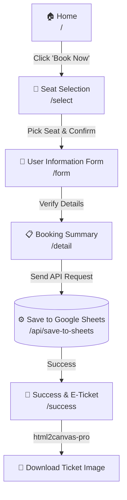

# 🎭 Theatre Ticket Booking System

A web application for booking theatre tickets for **"The Loot Dead Game 2026"**, developed with [Next.js](https://nextjs.org/) (App Router). Designed to be user-friendly, it generates downloadable E-Tickets and saves booking data in real-time to Google Sheets.

---

## ✨ Features

- **Landing Page & Teaser**: Engaging homepage with an auto-playing video background and theatrical details.
- **Interactive Seat Selection**: Interactive seat map allowing users to pick their rows and exact seat positions.
- **Booking Form**: Simple user information form (name, phone number, email) to complete the reservation.
- **Google Sheets Integration**: Automatically sends booking data to your connected Google Sheet as a new row via an API Route.
- **E-Ticket Generator**: Creates a beautiful E-Ticket in the success page, allowing users to download it as a PNG image file (powered by `html2canvas-pro`).
- **Dark Mode / Light Mode**: Supports theme toggling using `next-themes`.

---

## 🔄 Flow Diagram



---

## 🚀 Getting Started

### 1. Installation
Clone the repository, navigate into the project folder, and install dependencies:

```bash
npm install
```

### 2. Environment Variables (.env)
The backend uses a Google Apps Script Web App as its database. You need to create a `.env` file in the root directory of your project and add the following variable:

```env
GOOGLE_SHEETS_WEB_APP_URL="https://script.google.com/macros/s/YOUR_WEB_APP_ID/exec"
```
*(Replace `YOUR_WEB_APP_ID` with the actual URL from your deployed Google Apps Script).*

### 3. Run Development Server
Start the local development server:

```bash
npm run dev
```
Open your browser and navigate to [http://localhost:3000](http://localhost:3000).

---

## 🛠 Development Guide

If you wish to modify or extend the project, here is how you can customize its main components:

- **Frontend Seat Availability (`/app/select/page.tsx`)**: The UI allows seat selection. To lock booked seats, implement an API to fetch the current availability status from Google Sheets before rendering the seats.
- **State Management (`/app/context/BookingContext.tsx`)**: The project uses React Context API to manage and share states (e.g., "selected seats", "customer name") across pages. Add variables here if you need to track more details like price or discount codes.
- **Backend API (`/app/api/save-to-sheets/route.ts`)**: This endpoint handles the fetch request sent to Google Sheets. You can add extra validation logic here, or modify it to connect to a different database (like Firebase, Supabase, Prisma) instead of Google Sheets.
- **E-Ticket Customization (`/app/success/page.tsx`)**: The E-Ticket image relies on inline CSS styles to ensure `.html2canvas` renders properly. You can modify the layouts, fonts, or sponsor logos directly in this file.

---

## 💻 Tech Stack

- **Framework:** [Next.js](https://nextjs.org) (App Router Version)
- **UI & Styling:** [Tailwind CSS](https://tailwindcss.com/) & [shadcn/ui](https://ui.shadcn.com/)
- **Icons:** [Lucide-React](https://lucide.dev/)
- **Screenshot Parsing:** [html2canvas-pro](https://www.npmjs.com/package/html2canvas-pro)
